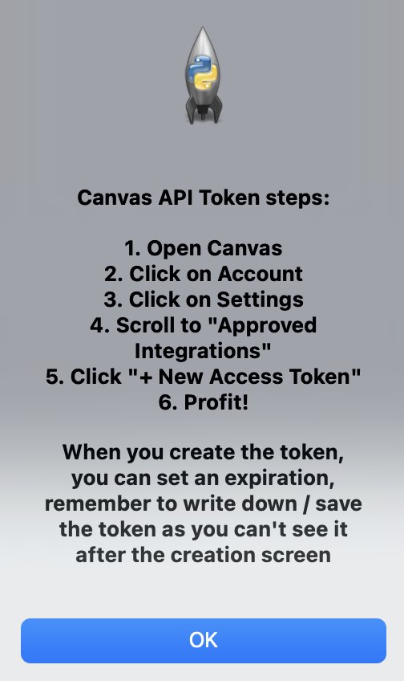

# Canvas Grade Getter

Essentially, I was having trouble navigating Canvas all 
the time to see my grades by going to each class separately, 
so I made a program that gets it all for me.

If you want to use the saved load functionality, create a 
text file within your directory on the same level as the main 
program, with the following info in this style:

\<domain name\>,\<token\>

Where, of course, don't include the \<\> signs, and replace the 
words with the actual domain and token you are using.

	
  

